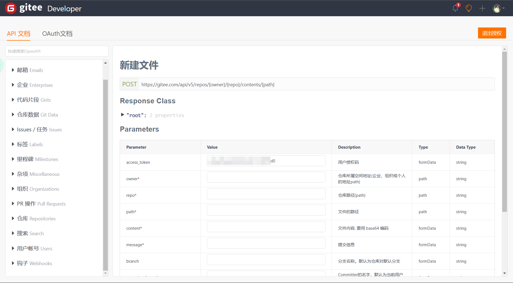
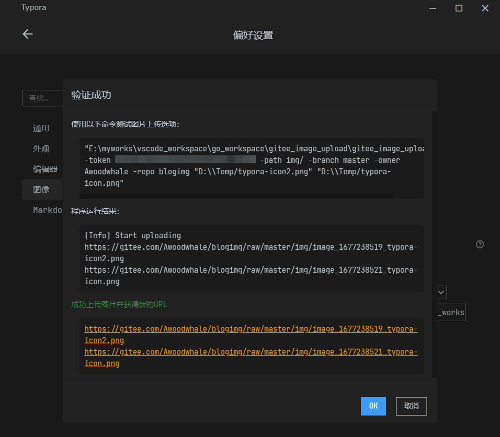

# gitee image upload

> 一个使用golang自带net、flag库编写的gitee图床上传工具

## 使用方式

在使用本项目之前，需要前往gitee开通[api接口权限](https://gitee.com/api/v5/swagger#/postV5ReposOwnerRepoContentsPath)，授权完成后，token会自动填写在接口测试处，复制记录带入本项目`-token`参数即可



或者前往个人设置，生成个人令牌，获取token

```bash
go build -o gitee_image_upload.exe main.go # Windows
go build -o gitee_image_upload main.go #Linux / Mac
```

参数列表：
- token（必填） gitee操作的凭证
- owner（必填） gitee用户名
- repo（必填） gitee仓库名
- path（必填） gitee上传文件的位置，例如 `imgs/`
- branch（选填） gitee仓库的分支，不填就是默认分支
- message（选填） gitee上传的message
- image_path（必填） 本地图片路径，支持多个文件上传，但是本参数一定要填写在最后，且不能使用`-image_path`的方式

使用例子：

```bash
./gitee_image_upload.exe -token p76e2fbxad20af7b6c22617c4fp5f9d0 -path img/ -branch master -owner Awoodwhale -repo blogimg "D:/Temp/typora-icon2.png" "D:/Temp/typora-icon.png" 
```

```bash
Usage: gitee_image_upload [-h] [-token string] [-owner string] [-repo string] [-path string] [-branch string] [-message string] {image_path}
  -branch string
        gitee repo branch
  -message string
        gitee upload action message (default "upload image")
  -owner string
        gitee owner
  -path string
        gitee repo path (default "/")
  -repo string
        gitee repo
  -token string
        gitee token
```

## 高级操作

本项目可以结合Typora使用，设置Typora自定义图片上传指令为

```bash
"E:\myworks\vscode_workspace\go_workspace\gitee_image_upload\gitee_image_upload.exe"  -token 你的token -path 想要上传的路径 -branch master -owner 你的gitee用户名 -repo 你的gitee仓库 
```


